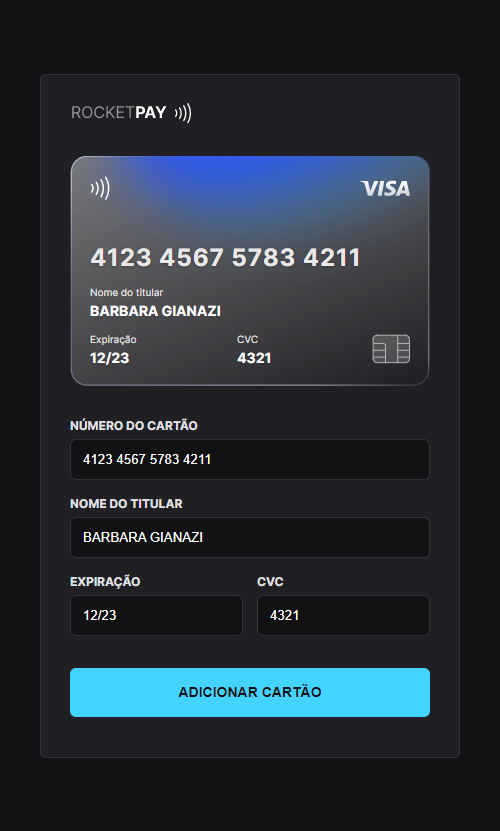
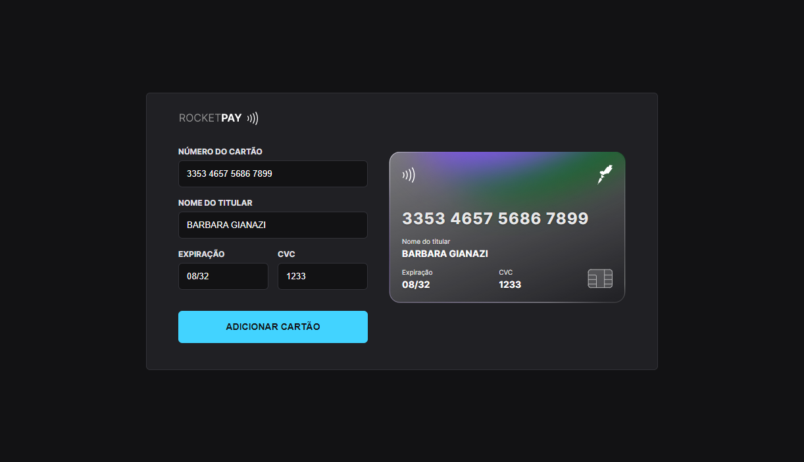

<h1 align="center">💳 RocketPAY  </h1>

O projeto teve como foco o uso da tecnologia JavaScript, mais especificamente na <b>manipulação da DOM (Document Object Model)</b>, onde através dela foi possível alterar elementos do HTML e CSS de forma dinânimica e em tempo real, sendo aplicadas na validação de dados de um usuário/comprador ao inserir as informações de seu cartão de crédito, assim como ocorre em grandes plataformas de compras on-line.

Validações essas como, qual <b>bandeira o cartão de crédito</b> pertence, o <b>período de expiração</b> informado está dentro do período estabelecido, assim como validações de <b>limite de caracteres</b> e aceite apenas de números nos campos específicos, além da <b>aplicação de máscaras</b> para formatar os dados inseridos.

 
 

# 🖼️ Prints do projeto
## 📱 Versão mobile

 

## 💻 Versão desktop

 

 

## 💻 Explorer Lab #01
Evento exclusivo e gratuito com duração de uma semana, promovido pela Rocketseat para ensino de tecnologias WEB.

 

## 🚀 Tecnologias

Esse projeto foi desenvolvido com as seguintes tecnologias:

- HTML e CSS
- JavaScript e JSON
- [Node e NPM](https://nodejs.org/)
- [Vite](https://vitejs.dev/)
- [iMask](https://imask.js.org)

---
